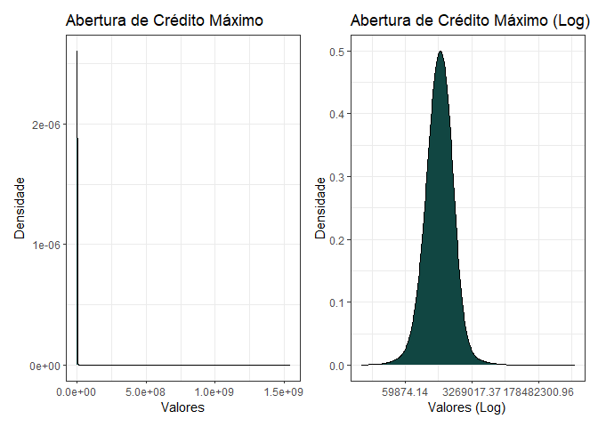
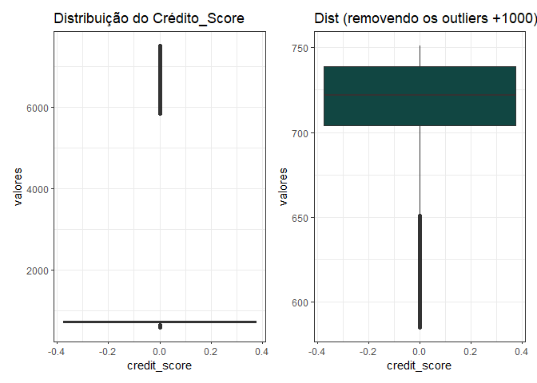
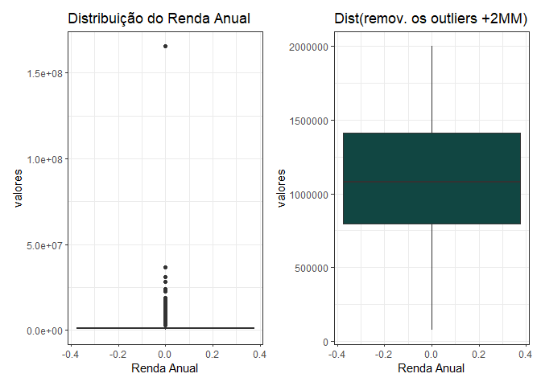

<!-- README.md is generated from README.Rmd. Please edit that file -->


# Análise de Crédito

<!-- badges: start -->
<!-- badges: end -->

#### O objetivo desse estudo consiste na análise dos dados históricos de empréstimos e na elaboração de um modelo de classificação para concessão de crédito.

#### Os dados foram coletados no site: <https://www.kaggle.com/zaurbegiev/my-dataset> e armazenados no banco de dados SQL Server 2017.

##### Etapas:

##### 1 - Análise exploratória do conjunto de dados.

##### Pacotes utilizados na análise

``` r
library(odbc)
library(tidyverse)
library(questionr)
library(knitr)
library(patchwork)
library(plotly)
```

##### Estabelecendo conexão com o banco de dados SQL Server 2017, para extração/leitura dos dados.

``` r
con <- dbConnect(odbc(),
                 Driver = "ODBC Driver 17 for SQL Server",
                 Server = "##",
                 Database = "projetobank",
                 UID = "##",
                 PWD = '##',
                 Port ='##')
```

##### Carregando os dados do banco pro R.

``` r
df_bank_train <- dbGetQuery(con, 'SELECT * FROM bank_train')
```

##### Ajustando os nomes das variáveis

``` r
df_bank_train <-  janitor::clean_names(df_bank_train)
```

##### Info dos dados:

##### O o dataframe tem 100.514 observações e um conjunto de 19 variáveis.

##### A variável target para esse estudo será (loan\_status).

``` r
glimpse(df_bank_train)
#> Rows: 100,514
#> Columns: 19
#> $ loan_id                      <chr> "0305335e-fb77-4ba0-b74a-de817b2fe445", "~
#> $ customer_id                  <chr> "66316030-867a-48fe-befc-8b74dc359582", "~
#> $ loan_status                  <chr> "Fully Paid", "Fully Paid", "Fully Paid",~
#> $ current_loan_amount          <dbl> 99999999, 266244, 222970, 182204, 196526,~
#> $ term                         <chr> "Short Term", "Short Term", "Short Term",~
#> $ credit_score                 <dbl> 699, NA, 716, 7380, 708, 6010, NA, NA, 71~
#> $ annual_income                <dbl> 806949, NA, 577695, 1498720, 565725, 1974~
#> $ years_in_current_job         <chr> "10+ years", "10+ years", "10+ years", "3~
#> $ home_ownership               <chr> "Rent", "Rent", "Home Mortgage", "Rent", ~
#> $ purpose                      <chr> "Debt Consolidation", "Debt Consolidation~
#> $ monthly_debt                 <dbl> 11902.55, 14490.92, 13046.35, 20232.72, 9~
#> $ years_of_credit_history      <dbl> 12.8, 18.6, 20.5, 21.3, 9.8, 17.6, 9.5, 1~
#> $ months_since_last_delinquent <dbl> 40, NA, 41, 30, NA, 5, 6, 76, 7, 17, NA, ~
#> $ number_of_open_accounts      <dbl> 9, 8, 18, 10, 12, 10, 10, 7, 18, 6, 12, 1~
#> $ number_of_credit_problems    <dbl> 0, 0, 0, 0, 0, 0, 0, 0, 0, 0, 0, 0, 0, 1,~
#> $ current_credit_balance       <dbl> 80693, 207005, 210216, 213769, 113905, 21~
#> $ maximum_open_credit          <dbl> 347336, 394856, 448272, 342848, 181170, 2~
#> $ bankruptcies                 <dbl> 0, 0, 0, 0, 0, 0, 0, 0, 0, 0, 0, 0, 0, 1,~
#> $ tax_liens                    <dbl> 0, 0, 0, 0, 0, 0, 0, 0, 0, 0, 0, 0, 0, 0,~
```

##### Existem dados faltantes no conjunto de dados?

``` r
freq.na(df_bank_train)
#>                              missing  %
#> months_since_last_delinquent   53655 53
#> credit_score                   19668 20
#> annual_income                  19668 20
#> bankruptcies                     718  1
#> tax_liens                        524  1
#> maximum_open_credit              516  1
#> loan_id                          514  1
#> customer_id                      514  1
#> loan_status                      514  1
#> current_loan_amount              514  1
#> term                             514  1
#> years_in_current_job             514  1
#> home_ownership                   514  1
#> purpose                          514  1
#> monthly_debt                     514  1
#> years_of_credit_history          514  1
#> number_of_open_accounts          514  1
#> number_of_credit_problems        514  1
#> current_credit_balance           514  1
```

##### Como a maior parte das variáveis apresenta 514 dados faltantes, verifiquei se são linhas inteiras de NA.

##### Visto que, o teste resultou em um conjunto de dados faltantes uniformes, optei pelo descarte.

##### A tabela abaixo representa o novo conjunto de dados.

``` r
df_bank_train <- df_bank_train %>% 
                 filter(!is.na(loan_id))

freq.na(df_bank_train)
#>                              missing  %
#> months_since_last_delinquent   53141 53
#> credit_score                   19154 19
#> annual_income                  19154 19
#> bankruptcies                     204  0
#> tax_liens                         10  0
#> maximum_open_credit                2  0
#> loan_id                            0  0
#> customer_id                        0  0
#> loan_status                        0  0
#> current_loan_amount                0  0
#> term                               0  0
#> years_in_current_job               0  0
#> home_ownership                     0  0
#> purpose                            0  0
#> monthly_debt                       0  0
#> years_of_credit_history            0  0
#> number_of_open_accounts            0  0
#> number_of_credit_problems          0  0
#> current_credit_balance             0  0
```

##### Após esse filtro ficamos com dados ausentes nas variáveis:

###### 53% months\_since\_last\_delinquent (Meses desde a última inadimplência)

###### 19% credit\_score (score de crédito)

###### 19% annual\_income (renda anual)

###### 204 obs. bankruptcies (falência)

###### 10 obs. tax\_liens (registro de automóveis)

###### 2 obs. maximum\_open\_credit (abertura máxima de crédito)

##### Tratamento das varáveis faltantes:

##### 204 obs. bankruptcies (falência)

###### Conforme análise da tabela de frequência relativa, foi verificado que a distribuiçao % se comporta como nas faixas \[0,1,2,3,4,5\] entre (22,74% - 28,57%) de Charge Off e (77.26 % - 71.43 %). Devido a relação com a variável target e ao baixo número de observações, entendo que não vai influenciar no resultado do modelo a imputação pela faixa com mais observações da variável bankruptcies (0).

``` r
  df_bank_train %>%
  group_by(bankruptcies, loan_status) %>% 
  summarise(qnt = n()) %>% 
  complete(bankruptcies, fill = list(n = 0)) %>% 
  group_by(bankruptcies) %>% 
  mutate(freq = paste(round(qnt / sum(qnt),4)*100,'%'))
#> `summarise()` has grouped output by 'bankruptcies'. You can override using the `.groups` argument.
#> # A tibble: 16 x 4
#> # Groups:   bankruptcies [9]
#>    bankruptcies loan_status   qnt freq   
#>           <dbl> <chr>       <int> <chr>  
#>  1            0 Charged Off 20183 22.74 %
#>  2            0 Fully Paid  68591 77.26 %
#>  3            1 Charged Off  2287 21.83 %
#>  4            1 Fully Paid   8188 78.17 %
#>  5            2 Charged Off    92 22.06 %
#>  6            2 Fully Paid    325 77.94 %
#>  7            3 Charged Off    18 19.35 %
#>  8            3 Fully Paid     75 80.65 %
#>  9            4 Charged Off     7 25.93 %
#> 10            4 Fully Paid     20 74.07 %
#> 11            5 Charged Off     2 28.57 %
#> 12            5 Fully Paid      5 71.43 %
#> 13            6 Fully Paid      2 100 %  
#> 14            7 Fully Paid      1 100 %  
#> 15           NA Charged Off    50 24.51 %
#> 16           NA Fully Paid    154 75.49 %
```

``` r
  df_bank_train$bankruptcies <- df_bank_train$bankruptcies %>% 
  coalesce(0)
```

##### 2 obs. maximum\_open\_credit (abertura máxima de crédito)

###### Optei por preencher com a mediana dos dados.

###### Ao tirar algumas estatísticas e visualizações dessa váriável fica claro o quanto assímetrico é a distribuição.

###### A média é muito maior que a mediana, visualmente percebemos uma curva assimétrica a direita, com amplitude (0 - 1.539.737.892).

    #> [1] "Média: 760798.38"
    #> [1] "Mediana: 467874"
    #> [1] "Desvio Padrão: 8384503.47"
    #> [1] "Máximo: 1539737892"
    #> [1] "Mínimo: 0"

##### O gráfico abaixo mostra a curva de densidade da váriavel e de um possível ajuste dos dados.



``` r
  df_bank_train$maximum_open_credit <- df_bank_train$maximum_open_credit %>% 
  coalesce(median(df_bank_train$maximum_open_credit, na.rm = TRUE))
```

##### 10 obs. tax\_liens (registro de automóveis)

###### A distribuição da variável com relação a variável resposta nos níveis da tax\_liens não sofre tanta alteração e o número de observações é baixo. As observações faltantes estão todas no grupo ‘Fully Paid’.

###### Optei por substituir as variáveis faltantes pelo maior grupo da ‘tax\_liens’ 0.

``` r
df_bank_train %>%
  group_by(tax_liens, loan_status) %>%
  summarise(qnt = n()) %>%
  complete(tax_liens, fill = list(n = 0)) %>%
  group_by(tax_liens) %>%
  mutate(freq = paste(round(qnt / sum(qnt),4)*100,'%'))
#> `summarise()` has grouped output by 'tax_liens'. You can override using the `.groups` argument.
#> # A tibble: 22 x 4
#> # Groups:   tax_liens [13]
#>    tax_liens loan_status   qnt freq   
#>        <dbl> <chr>       <int> <chr>  
#>  1         0 Charged Off 22150 22.59 %
#>  2         0 Fully Paid  75912 77.41 %
#>  3         1 Charged Off   330 24.57 %
#>  4         1 Fully Paid   1013 75.43 %
#>  5         2 Charged Off    90 24.06 %
#>  6         2 Fully Paid    284 75.94 %
#>  7         3 Charged Off    36 32.43 %
#>  8         3 Fully Paid     75 67.57 %
#>  9         4 Charged Off    21 36.21 %
#> 10         4 Fully Paid     37 63.79 %
#> # ... with 12 more rows


df_bank_train$tax_liens <- df_bank_train$tax_liens %>% 
  coalesce(0)
```

##### 19% credit\_score (score de crédito)

##### 19% annual\_income (renda anual)

###### As variáveis que estão faltando em score de crédito também estão faltando na coluna de renda anual.

``` r
df_bank_train %>% 
  filter(is.na(credit_score)) %>% 
  select(credit_score, annual_income) %>% 
  drop_na(credit_score, annual_income)
#> [1] credit_score  annual_income
#> <0 linhas> (ou row.names de comprimento 0)
```

##### Inspecionando a variável (score de crédito)

``` r
g2
#> Warning: Removed 19154 rows containing non-finite values (stat_boxplot).
```



##### Inspecionando a variável (renda anual)

``` r
g3
#> Warning: Removed 19154 rows containing non-finite values (stat_boxplot).
```

<!-- -->

###### Optei por substituir as variáveis faltantes pela média em ambos casos, no entanto irei avaliar futuramente com a construção do modelo a necessidade de trabalhar melhor essas variáveis.

``` r
df_bank_train$credit_score <- df_bank_train$credit_score %>% 
                              coalesce(mean( df_bank_train$credit_score, na.rm = TRUE))

df_bank_train$annual_income <- df_bank_train$annual_income %>% 
                              coalesce(mean( df_bank_train$annual_income, na.rm = TRUE))
```

``` r
freq.na(df_bank_train)
#>                              missing  %
#> months_since_last_delinquent   53141 53
#> loan_id                            0  0
#> customer_id                        0  0
#> loan_status                        0  0
#> current_loan_amount                0  0
#> term                               0  0
#> credit_score                       0  0
#> annual_income                      0  0
#> years_in_current_job               0  0
#> home_ownership                     0  0
#> purpose                            0  0
#> monthly_debt                       0  0
#> years_of_credit_history            0  0
#> number_of_open_accounts            0  0
#> number_of_credit_problems          0  0
#> current_credit_balance             0  0
#> maximum_open_credit                0  0
#> bankruptcies                       0  0
#> tax_liens                          0  0
```
